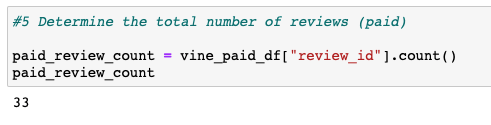
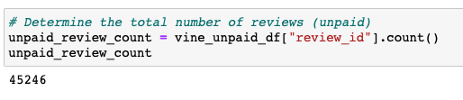
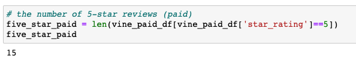
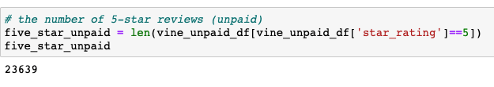
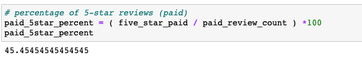
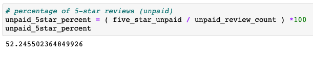

# Amazon_Vine_Analysis

## Purpose

The purpose of this project is to analyze Amazon reviews written by members of the paid Amazon Vine program. The Amazon Vine program is a service that allows manufacturers and publishers to receive reviews for their products. Companies like SellBy pay a small fee to Amazon and provide products to Amazon Vine members, who are then required to publish a review.

In this project we have access to approximately 50 datasets. Each one contains reviews of a specific product, from clothing apparel to wireless products. The dataset I choose to analyze is the "Apparel" category. 

We would use PySpark to perform the ETL process to extract the dataset, transform the data, connect to an AWS RDS instance, and load the transformed data into pgAdmin. Then we will use Python-Pandas to determine if there is any bias toward favorable reviews from Vine members in your dataset. 

## Results

### There are total 33 Vine reviews (paid).

### There are total 45246 non-Vine reviews (unpaid).

### 15 Vine reviews were 5 stars (paid).

### 23639 non-Vine reviews were 5 stars (unpaid).

### 45% of Vine reviews were 5 stars (paid)

### 52% of non-Vine reviews were 5 stars (unpaid)

## Summary

Based on the results there is no positivity bias for reviews in the Vine program. In other words, Vine members did not give higher ratings for their products. In fact, their percentage of 5-star ratings were about 7% lower than non-Vine users. One assumption is that Vine members are more critical and serious when publish reviews. Additional analysis to support the assumption is to calculate the statistical distribution such as mean, median and mode for Vine versus non-Vine reviews.
